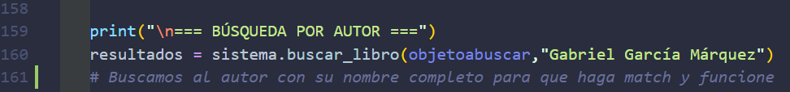
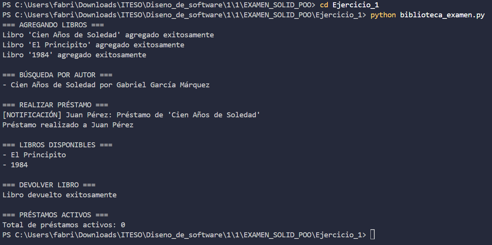
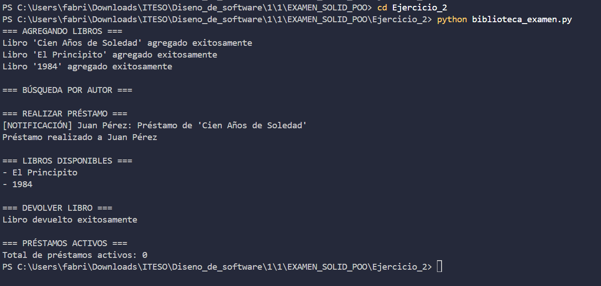
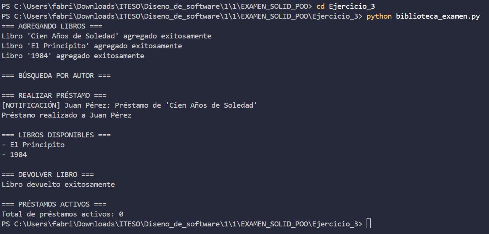

# Examen parcial 1
Sistema de Mini-Biblioteca refactorizado
## Estructura del proyecto

```bash
EXAMEN_SOLID_POO/
├── Ejercicio_1/
│   ├── __pycache__/
│   ├── biblioteca_examen.py
│   └── biblioteca.txt
│   └── Ejercicio1.py
│
├── Ejercicio_2/
│   ├── __pycache__/
│   ├── biblioteca_examen.py
│   ├── biblioteca.txt
│   ├── Notificacion.py
│   ├── Repositorio.py
│   └── Validador.py
│
├── Ejercicio_3/
│   ├── __pycache__/
│   ├── biblioteca_examen.py
│   ├── biblioteca.txt
│   ├── Notificacion.py
│   ├── Repositorio.py
│   └── Validador.py
│
├── templates/
├── biblioteca_examen.py
├── biblioteca.txt
├── EXAMEN_SOLID_POO.md
└── RUBRICA_EXAMEN_SOLID_POO.md
```
## Ejecucion
Dependiendo del ejercicio a correr te diriges a la carpeta mediante la terminal como se muestra a continuacion:
### Ejercicio 1
```bash
EXAMEN_SOLID_POO\Ejercicio_1> python biblioteca_examen.py
```
En caso de querer buscar otro autor cambiar le sehundo parameto de la funcion de la linea 160 donde indica la imagen.


### Ejercicio 2
```bash
EXAMEN_SOLID_POO\Ejercicio_2> python biblioteca_examen.py
```

En este ejercicio unicamente se requiere el comando para iniciar el programa y funcionara como funcionaba el archivo base
### Ejercicio 3
```bash
EXAMEN_SOLID_POO\Ejercicio_3> python biblioteca_examen.py
```

En este ejercicio unicamente se requiere el comando para iniciar el programa y funcionara como funcionaba el archivo base
## Salidas esperadas

### Ejercicio 1

### Ejercicio 2

### Ejercicio 3
